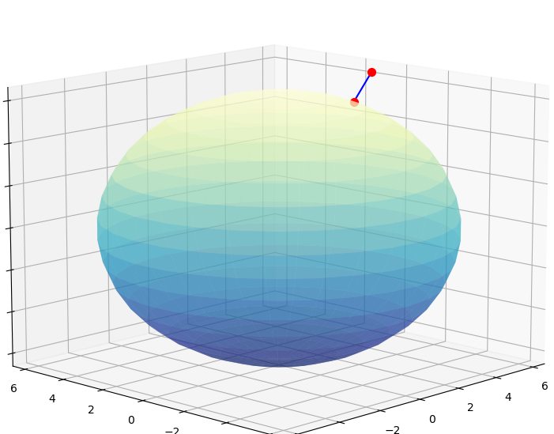

# pre-detector-signal
pre-detector signal with a binary file as a result at a given time interval.

## Задачи
1. Разработать модель и ее программную реализацию преддетекторной записи сигнала. 
Результатом моделирования является бинарный файл, созданный на заданном участке  времени.

#### Параметры передающей системы:
- мощность передатчика 1 Вт,
- центральная частота 433 МГц,
- вид модуляции - ФМ-2.  
- мод. скорость(полоса) - 4096.

#### Параметры приемной системы:
- начальный уровень сигнала на приемной антенне - 1 мВ,
- коэффициент усиления - 3000,
- разрядность АЦП - 16,
- форма представления чисел - комплексные,
- предельное(опорное) напряжение АЦП - 5 В,
- частота дискретизации - 2.5 МГц.
- начальный уровень отношения сигнал/шум - 20 дБ, при уровне естественного шума - 8 дБ. Распределение шума - гауссовское.

#### Перечень и структура передаваемых параметров:
- температура,
- скорость ветра,
- влажность,
- координаты в СК WGS84 (X, Y, Z, VX, VY, VZ›,
- напряжение бортового источника питания,
- контрольное напряжение (константа).
- Порядок передаваемых параметров может быть произвольным. Данные на протяжении всей передачи должны сохранять единую структуру.

Для идентификации начала посылки вводится *заголовок*, содержащий:
- маркер начала кадра (значение: 11111100000(2),
- номер текущего кадра,
- время текущего кадра для упрощения задачи принимается условие, 
что все измерения производятся одновременно, шаг дискретизации задается пользователем в интервале от 0.01 до 0.5 секунды).

Каждый параметр передается 14-и разрядным словом, порядок следования бит от старшего к
младшему. Координатные параметры передаются парами 14-и разрядных слов. 

Непосредственно измерения передаются с 12-го по 1-й бит. О-й бит содержит признак четности, 13-й бит является маркерным.

Кроме кадровой структуры, в информацию добавляется параметр синхронизации, который задается 
15-и разрядной М - последовательностью 111100010011010, то есть каждый бит последовательности является началом измерительного слова.
Следование разрядов маркера не зависит от количества слов в кадре (количество параметров может быть больше или меньше 15-и).

Вся информационная последовательность закрыта помехозащищенным кодом методом [дифференциального кодирования](https://en.wikipedia.org/wiki/Differential_Manchester_encoding).

Условия модели движения объекта:
- зонд поднимается на заданную высоту, скорость подъема линейная зависимость, скорость сноса ветром экспоненциальная зависимость в одном направлении.

2) Используя формулу Фрииса расчитать уровень сигнала от степени удаления объекта от Земли (допускается, 
что приемник находится в точке старта). Учесть данный фактор при моделировании уровня модуляции.
3) По проделанной работе составить письменный отчет, с приложением графиков комплексного спектра модельного сигнала на
разных участках времени и графиков измеряемых параметров.
### Примечание.
Приложения моделирования и обратного извлечения разрешается делать в консольном виде, тогда параметры настройки должны
передаваться в виде конфигурационного файла, для этой цели целесообразно использовать формат _json_.

